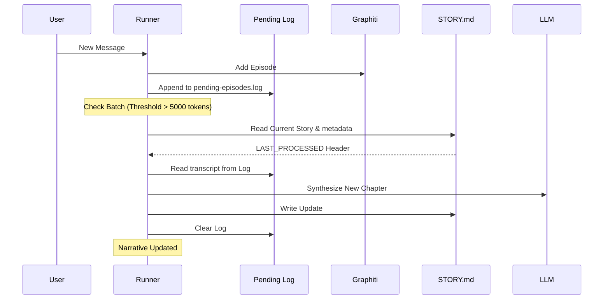

# Mind Memory & Subconscious Architecture

Moltbot implements a **Dual-Process Theory of Mind**, separating immediate conversational logic from long-term narrative identity and semantic resonance.

## 1. Architectural Overview

The memory system is divided into two primary loops:

### A. The Conscious System (Foreground)
*   **Context Window**: Holds the short-term chat history for immediate response generation.
*   **Direct Recall Tools**: 
    *   `remember`: Queries the knowledge graph for facts and entities.
    *   `journal_memory_search`: Searches the local `MEMORY.md` and `memory/` files.
    *   `journal_memory_get`: Reads specific snippets from the journal.

**Strict Recall Protocol**: 
Moltbot is instructed to check *both* memory systems (`remember` and `journal_memory_search`) before answering any questions about prior work, decisions, or user preferences.

### B. The Subconscious System (Background)
*   **Memory Resonance**: Before every turn, the system queries the **Graphiti** graph database to find "Flashbacks"—past moments that resonate with the current topic.
*   **Narrative Consolidation**: A background process distills raw conversation (batched by token count) into a persistent, first-person autobiography (`STORY.md`).

---

## 2. Memory Components

### Graphiti (Episodic & Semantic)
Moltbot uses Graphiti as its primary long-term repository. 
*   **Episodes**: Every turn is stored as a raw chronological event.
*   **Neural Resonance**: Retrieval-Augmented Generation (RAG) using semantic search to find relevant past interactions.
*   **Heartbeat Isolation**: Messages like `HEARTBEAT_OK` are filtered out before reaching the graph to maintain signal quality.

### Mind Memory (`STORY.md`)
The core of Moltbot's identity is stored in a local Markdown file.
*   **The Global Story**: A first-person narrative ("I", "My") that evolves with the user.
*   **Global Scope**: All interactions across channels are consolidated into a single identity (`global-user-memory`).
*   **Persistence**: Unlike context-window memory, the story is perpetual and survives session resets.

---

## 3. The Consolidation Pipeline

To keep the narrative updated without overwhelming the context, the system follows this workflow:

### Safety & Integrity Mechanisms
*   **Audit Log**: The `pending-episodes.log` provides a reliable, auditable trace of what is about to be narrativized.
*   **Metadata Anchors**: Employs an invisible HTML comment `<!-- LAST_PROCESSED: [ISO] -->` to track narrated progress.
*   **Heartbeat Protection**: Consolidation is explicitly skipped for heartbeat turns.

---

## 4. Prompt Injection
During every agent turn, the `STORY.md` content is injected into the System Prompt. This provides the agent with:
*   **Historical Weight**: Knowledge of how the relationship has evolved over months.
*   **Temporal Awareness**: Ability to comment on the passage of time.
*   **Consistent Voice**: Self-reinforcement of its own character arc.

---
*Document Version: 2.1.0 - "The Scribe of the Global Mind"*
