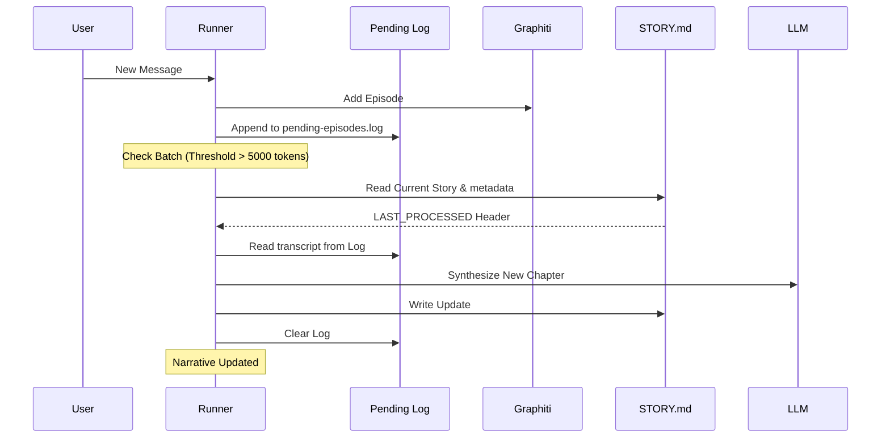

# Mind Memory & Subconscious Architecture

MindBot (OpenClaw fork) implements a **Dual-Process Theory of Mind**, separating immediate conversational logic from long-term narrative identity and semantic resonance.

## 1. Architectural Overview

The memory system is divided into two primary loops:

### A. The Conscious System (Foreground)
*   **Context Window**: Holds the short-term chat history for immediate response generation.
*   **Direct Recall Tools**:
    *   `remember`: Queries the Graphiti knowledge graph for facts and entities.
    *   `journal_memory_search`: Semantically searches Markdown chunks from `MEMORY.md` and `memory/*.md`.
    *   `journal_memory_get`: Reads specific memory file content by path.

**Recall Protocol**:
When the `mind-memory` plugin is active, the system prompt instructs the agent to check *both* memory systems (`remember` for the knowledge graph, `journal_memory_search` for Markdown files) before answering questions about prior work, decisions, or user preferences. When only the base memory plugin is active, the prompt guides `journal_memory_search` / `journal_memory_get` only.

### B. The Subconscious System (Background)
*   **Memory Resonance**: Before every turn, the system queries the **Graphiti** graph database to find "Flashbacks"—past moments that resonate with the current topic.
*   **Narrative Consolidation**: A background process distills raw conversation (batched by token count) into a persistent, first-person autobiography (`STORY.md`).

---

## 2. Memory Components

### Graphiti (Episodic & Semantic)
MindBot uses Graphiti (via MCP server) as its primary long-term repository.
*   **Episodes**: Every turn is stored as a raw chronological event.
*   **Entities (Nodes)**: People, places, concepts extracted from conversations.
*   **Facts (Edges)**: Relationships and facts connecting entities.
*   **Neural Resonance**: Retrieval-Augmented Generation (RAG) using semantic search to find relevant past interactions.
*   **Heartbeat Isolation**: Messages like `HEARTBEAT_OK` are filtered out before reaching the graph to maintain signal quality.
*   **Docker-based**: Runs via Docker Compose with FalkorDB backend at `http://localhost:8001`.

### Mind Memory (`STORY.md`)
The core of MindBot's identity is stored in a local Markdown file.
*   **The Global Story**: A first-person narrative ("I", "My") that evolves with the user.
*   **Global Scope**: All interactions across channels are consolidated into a single identity (`global-user-memory`).
*   **Persistence**: Unlike context-window memory, the story is perpetual and survives session resets.
*   **Injection**: Content is injected into the agent's system prompt every turn, providing historical weight and temporal awareness.

---

## 3. The Consolidation Pipeline

To keep the narrative updated without overwhelming the context, the system follows this workflow:



### Safety & Integrity Mechanisms
*   **Audit Log**: The `pending-episodes.log` provides a reliable, auditable trace of what is about to be narrativized.
*   **Metadata Anchors**: Employs an invisible HTML comment `<!-- LAST_PROCESSED: [ISO] -->` to track narrated progress.
*   **Heartbeat Protection**: Consolidation is explicitly skipped for heartbeat turns.

---

## 4. Technical Implementation

### ConsolidationService

**File**: `src/services/memory/ConsolidationService.ts`

The ConsolidationService handles narrative generation and STORY.md updates:

*   **syncStoryWithSession**: Main consolidation method that processes a batch of messages.
*   **Type Safety**: Strict type validation prevents corruption (e.g., `[object Object]` bug fix):
    ```typescript
    let rawStory = typeof response?.text === "string" ? response.text : "";
    ```
*   **Comprehensive Validation**: Logs unexpected response types, empty strings, and errors.
*   **Two-Phase Processing**:
    1. **Primary Response**: Generate new narrative chapter from messages.
    2. **Compression** (optional): If story exceeds length limit, compress older sections.

### SubconsciousAgent Factory

**File**: `src/agents/pi-embedded-runner/subconscious-agent.ts`

Factory function that creates a lightweight LLM client for narrative generation:

*   **Streaming**: Uses `streamSimple` from `@mariozechner/pi-ai` for efficient token streaming.
*   **Error Detection**: Detects error events emitted by the stream (not thrown as exceptions).
*   **Automatic Failover**: If primary model fails via Copilot, automatically retries with `gpt-4o`:
    ```typescript
    if (result.streamError && isCopilotProvider && result.text.length === 0) {
      // Failover to gpt-4o
    }
    ```
*   **Audio Format Handling**: Processes mu-law audio chunks (8kHz telephony standard).
*   **Debug Mode**: Comprehensive logging when `debug: true` is passed.

### Model Resolution

**File**: `src/agents/pi-embedded-runner/run.ts`

Narrative model resolution follows this hierarchy:

1. **mindConfig.config.narrative.provider/model**: Primary source for narrative-specific model.
2. **Chat model fallback**: If not configured, uses the main agent's chat model.
3. **Error handling**: If resolution fails, logs warning and falls back gracefully.

```typescript
const narrativeProvider =
  (mindConfig?.config as any)?.narrative?.provider || provider;
const narrativeModel =
  (mindConfig?.config as any)?.narrative?.model || modelId;
```

The SubconsciousAgent is created at two points in the agent lifecycle:

*   **Global narrative sync**: Before agent run starts (batch consolidation of recent sessions).
*   **Post-compaction**: After context window compaction (consolidate compacted messages).

### Integration Points

**Runner Integration** (`src/agents/pi-embedded-runner/run.ts`):

1. **Startup**: Loads STORY.md and injects into system prompt.
2. **Pre-turn**: Queries Graphiti for memory resonance ("Flashbacks").
3. **Post-turn**: Appends episode to Graphiti and pending-episodes.log.
4. **Batch trigger**: When log crosses threshold (~5000 tokens), triggers consolidation.
5. **Post-compaction**: Consolidates compacted messages into story.

**Safety Mechanisms**:
*   **Metadata Anchors**: `<!-- LAST_PROCESSED: [ISO] -->` tracks narrated progress.
*   **Heartbeat Protection**: Consolidation skipped for heartbeat turns.
*   **Audit Log**: `pending-episodes.log` provides reliable, auditable trace.
*   **Type Validation**: Strict type checking prevents object/string confusion.
*   **Graceful Degradation**: Empty responses return current story unchanged.

---

## 5. Prompt Injection
During every agent turn, the `STORY.md` content is injected into the System Prompt. This provides the agent with:
*   **Historical Weight**: Knowledge of how the relationship has evolved over months.
*   **Temporal Awareness**: Ability to comment on the passage of time.
*   **Consistent Voice**: Self-reinforcement of its own character arc.

---

## 6. Configuration

### Narrative Model Configuration

Configure the narrative model in your mindConfig:

```json5
{
  "mindConfig": {
    "config": {
      "narrative": {
        "provider": "anthropic",           // LLM provider for narrative
        "model": "claude-opus-4-6",        // Model for story generation
        "autoBootstrapHistory": true       // Load historical episodes on startup
      }
    }
  }
}
```

### Graphiti Configuration

```json5
{
  "plugins": {
    "entries": {
      "mind-memory": {
        "enabled": true,
        "config": {
          "graphiti": {
            "baseUrl": "http://localhost:8001",
            "autoStart": true                // Auto-start Docker containers
          }
        }
      }
    }
  }
}
```

### Memory Search Configuration

```json5
{
  "agents": {
    "defaults": {
      "memorySearch": {
        "provider": "openai",               // or "gemini", "local"
        "model": "text-embedding-3-small",
        "query": {
          "hybrid": {
            "enabled": true,                // Vector + BM25 keyword search
            "vectorWeight": 0.7,
            "textWeight": 0.3,
            "mmr": {
              "enabled": true,              // Diversity re-ranking
              "lambda": 0.7
            },
            "temporalDecay": {
              "enabled": true,              // Recency boost
              "halfLifeDays": 30
            }
          }
        }
      }
    }
  }
}
```

### Consolidation Thresholds

Consolidation triggers are configured in the ConsolidationService:

*   **Default token threshold**: ~5000 tokens in pending-episodes.log.
*   **Story length limits**: Configurable max length before compression.
*   **Batch size**: Adjustable based on model context window.

---

## 7. Debugging

### Common Issues

**1. `[object Object]` in STORY.md**
*   **Cause**: LLM returning empty object `{}` instead of string.
*   **Fix**: Strict type checking in ConsolidationService validates `typeof response?.text === "string"`.

**2. Empty LLM responses**
*   **Cause**: Model doesn't exist, deprecated, or prompt too large.
*   **Fix**: Automatic failover to `gpt-4o` via SubconsciousAgent.

**3. `undefined/undefined` model in logs**
*   **Cause**: `provider` and `modelId` not resolved from params correctly.
*   **Check**: Verify local variables from `resolveModel` are used, not `params.provider/model`.

**4. Graphiti connection failure**
*   **Cause**: Docker containers not running or port conflict.
*   **Fix**: Run `docker-compose -f extensions/mind-memory/docker-compose.yml up -d` or check port 8001/6379.

### Logging

Enable debug mode for detailed logging:

```typescript
const subconsciousAgent = createSubconsciousAgent({
  model: narrativeLLM,
  authStorage,
  modelRegistry,
  debug: true,  // Enable comprehensive logging
  autoBootstrapHistory: true
});
```

Debug logs include:
*   Stream open/close events
*   Payload details (model, API, baseUrl)
*   Token counts and elapsed time
*   Error events and failover attempts

---
*Document Version: 2.2.0 - "The Technical Scribe"*
